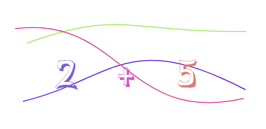

[](https://www.npmjs.com/package/svg-captcha-express)
[](https://www.npmjs.com/package/svg-captcha-express)
[](https://travis-ci.org/lazarofl/svg-captcha-express)

</div>

> Generate SVG captcha in NodeJS Express applications

## useful if you

- cannot or do not want to use google recaptcha
- have issue with install c++ addon
- have issue with install canvas dependency

## install

```
npm install --save svg-captcha-express
```

## usage

```Javascript
'use strict';

const express = require('express');
const session = require('express-session');
const bodyParser = require('body-parser');
const path = require('path');

const captchaUrl = '/captcha.jpg';
const captchaMathUrl = '/captcha_math.jpg';
const captchaSessionId = 'captcha';
const captchaFieldName = 'captcha';

const captcha = require('./index').create({
	cookie: captchaSessionId
});

//load custom font (optional)
captcha.loadFont(path.join(__dirname, './fonts/Comismsh.ttf'));

const app = express();
app.use(
	session({
		secret: 'your secret',
		resave: false,
		saveUninitialized: true
	})
);
app.use(bodyParser.urlencoded({ extended: false }));

app.get(captchaUrl, captcha.image());

app.get(captchaMathUrl, captcha.math());

app.get('/', (req, res) => {
	res.type('html');
	res.end(`
        
        <form action="/login" method="post">
            <input type="text" name="${captchaFieldName}"/>
            <input type="submit"/>
        </form>
        <a href='/'>refresh</a>
    `);
});

app.get('/math', (req, res) => {
	res.type('html');
	res.end(`
        
        <form action="/login" method="post">
            <input type="text" name="${captchaFieldName}"/>
            <input type="submit"/>
        </form>
        <a href='/math'>refresh</a>
    `);
});

app.post('/login', (req, res) => {
	res.type('html');
	res.end(`
        <p>CAPTCHA VALID: ${captcha.check(req, req.body[captchaFieldName])}</p>
    `);
});

app.listen(3000, function () {
  console.log('Listening on port 3000!');
});
```

## API

#### `svgCaptchaExpress.create(options)`

- `cookie`: `'captcha'`,
- `background`: `'rgb(255,200,150)'`,
- `fontSize`: `60`,
- `width`: `250`,
- `height`: `150`,
- `charPreset`: `'ABCDEFGHIJKLMNOPQRSTUVWXYZabcdefghijklmnopqrstuvwxyz0123456789'`,
- `size`: `5`,
- `noise`: `1`
- `size`: 4 // size of random string
- `color`: false // will generate random color for each character

#### `svgCaptcha.image()`

Will return an SVG captcha with random characters

#### Sample image result

default captcha image:


#### `svgCaptcha.math()`

Will return an SVG captcha with a random math expression

#### Sample image result

default captcha image with a math expression:



#### `svgCaptcha.check(req, text, caseSensitive)`

- `req`: express request
- `text`: Captcha input data
- `caseSensitive`: default `true`

#### `svgCaptcha.loadFont(url)`

Load your own font and override the default font.

- `url`: string // path to your font
  This api is a wrapper around loadFont api of opentype.js.
  Your may need experiment around various options to make your own font accessible.
  See the following api.

## why use svg?

It does not require any c++ addon.
The result image is smaller than jpeg image.

> This has to be a joke. /\<text.+\>;.+\<\/text\>/g.test...

svg captcha uses opentype.js underneath, which means that there is no
'&lt;text&gt;1234&lt;/text&gt;'.
You get
'&lt;path fill="#444" d="M104.83 19.74L107.85 19.74L112 33.56L116.13 19.74L119.15 19.74L113.48 36.85...'
instead.

Even though you can write a program that convert svg to png, svg captcha has done its job
—— make captcha recognition harder

# Issues

Please [add issues](https://github.com/lazarofl/svg-captcha-express/issues) if you have a question or found a problem. Pull requests are welcome too!

## License

[MIT](LICENSE.md)
