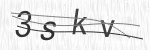
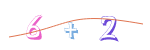

<div align="center">

[](https://travis-ci.org/lemonce/svg-captcha)
[](https://www.npmjs.com/package/svg-captcha)
[](https://www.npmjs.com/package/svg-captcha)

</div>

> generate svg captcha in node.js

## Translations
[中文](README_CN.md)

## useful if you

- cannot or do not want to use google recaptcha
- have issue with install c++ addon

## install
```
npm install --save svg-captcha
```

## usage
```Javascript
var svgCaptcha = require('svg-captcha');

var captcha = svgCaptcha.create();
console.log(captcha);
// {data: '<svg.../svg>', text: 'abcd'}
```
with express
```Javascript
var svgCaptcha = require('svg-captcha');

app.get('/captcha', function (req, res) {
	var captcha = svgCaptcha.create();
	req.session.captcha = captcha.text;
	
	res.type('svg');
	res.status(200).send(captcha.data);
});
```

## API

#### `svgCaptcha.create(options)`  
If no option is passed, you will get a random string of four characters and corresponding svg.  
  
* `size`: 4 // size of random string  
* `ignoreChars`: '0o1i' // filter out some characters like 0o1i  
* `noise`: 1 // number of noise lines  
* `color`: true // characters will have distinct colors instead of grey, true if background option is set  
* `background`: '#cc9966' // background color of the svg image  

This function returns an object that has the following property:
* `data`: string // svg path data
* `text`: string // captcha text

#### `svgCaptcha.createMathExpr(options)`  
Similar to create api, you have the above options plus 3 additional:
* `mathMin`: 1 // the minimum value the math expression can be
* `mathMax`: 9 // the maximum value the math expression can be
* `mathOperator`: + // The operator to use, `+`, `-` or `+-` (for random `+` or `-`)

This function returns an object that has the following property:
* `data`: string // svg of the math expression
* `text`: string // the answer of the math expression

#### `svgCaptcha.loadFont(url)`
Load your own font and override the default font.
* `url`: string // path to your font
This api is a wrapper around loadFont api of opentype.js.  
Your may need experiment around various options to make your own font accessible.  
See the following api.

#### `svgCaptcha.options`
Gain access to global setting object. 
It is used for create and createMathExpr api as the default options.  
  
In addition to size, noise, color, and background, you can also set the following property:
* `width`: number // width of captcha
* `height`: number // height of captcha
* `fontSize`: number // captcha text size
* `charPreset`: string // random character preset

#### `svgCaptcha.randomText([size|options])`  
return a random string.
#### `svgCaptcha(text, options)`
return a svg captcha based on text provided.  

In pre 1.1.0 version you have to call these two functions,  
now you can call create() to save some key strokes ;).

## sample image
default captcha image:



math expression image with color options:



## why use svg?

It does not require any c++ addon.  
The result image is smaller than jpeg image.

> This has to be a joke. /\<text.+\>;.+\<\/text\>/g.test...

svg captcha uses opentype.js underneath, which means that there is no
'&lt;text&gt;1234&lt;/text&gt;'.  
You get
'&lt;path fill="#444" d="M104.83 19.74L107.85 19.74L112 33.56L116.13 19.74L119.15 19.74L113.48 36.85...'  
instead.  
  
Even though you can write a program that convert svg to png, svg captcha has done its job  
—— make captcha recognition harder

## License
[MIT](LICENSE.md)
